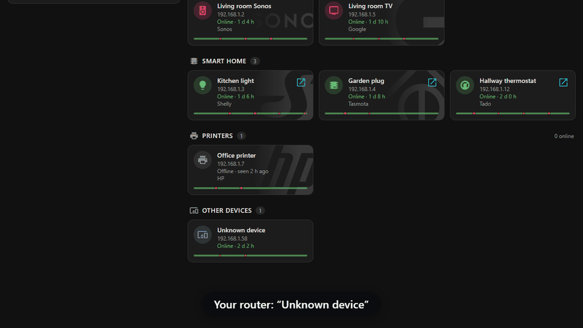
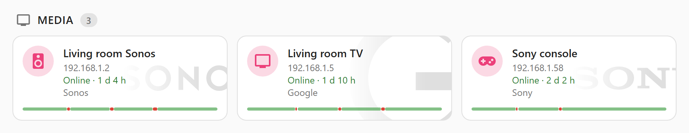
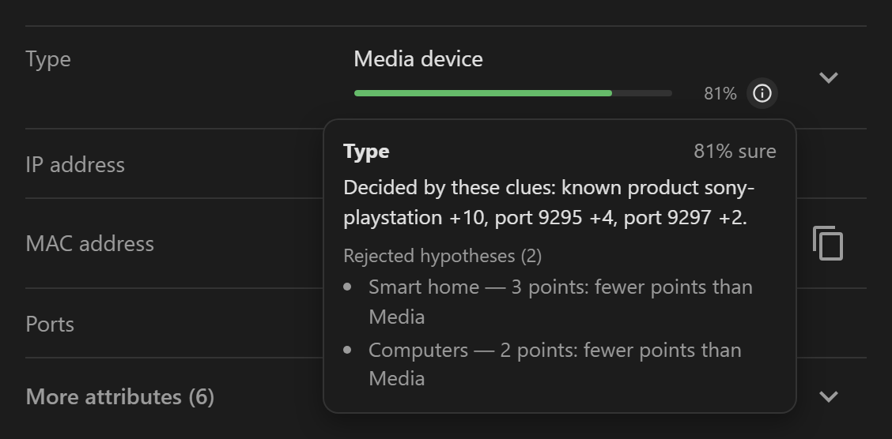

# Your router says “Unknown device”. Vedetta tells you what it is — and shows you why.

**A Home Assistant app that finds the devices on your LAN, works out what each one is, and shows the evidence.**

  

**[Install in 2 minutes](#install) · [How it explains itself](#show-your-work) · [Report a device](https://github.com/Sived80/vedetta/issues/new/choose) · [Docs](#documentation) · [Roadmap](docs/ROADMAP.md)**

An unknown device, a scan, a name — and the clues behind it

<picture><source media="(prefers-color-scheme: dark)" srcset="docs/images/group-dark.png"></picture>

---

## What is Vedetta

You have a few dozen devices on your network. Your router lists their IP addresses and, if you are lucky, a name like `Android_7F3A` or “Unknown device”. Home Assistant knows some of them. The rest are a guess.

Vedetta is the lookout of your LAN. It does three things, in this order:

| 🔭 Discover | 🧠 Recognize | 🔎 Explain |
|---|---|---|
| Finds every device on your network, with presence and latency history. | Works out name, brand, model and category from many weak clues, and stays honest when it does not know. | For every answer, shows the clues behind it and how much each one counted. |

It is a Home Assistant **app** (not a custom integration): install it from the App store, no YAML. It reads Home Assistant’s registry to learn the names and rooms you already chose, and publishes back **only what you decide to share**.

## Not another network scanner

A scanner gives you a list. Vedetta gives you an *answer* and the *reason*. The same device, seen two ways (an example):

| | A typical scanner | Vedetta |
|---|---|---|
| **What you see** | `192.168.1.23` · `AA:BB:CC:…` · Espressif Inc. | **Kitchen light** · Shelly · smart switch |
| **When it is not sure** | “Unknown device”, `Android_7F3A` | It says so and keeps the device in *Other* |
| **Why that name** | Not explained | Every clue behind it is one tap away, with its weight |
| **What you set by hand** | Can be lost at the next scan | Is never overwritten |

## Show your work

Every clue is weak on its own. Vedetta weighs them together, counts a repeated fact once, and shows doubt as doubt. The weights are public.

Tap the (i) next to a name, brand or type: every clue, its weight, and what was ruled out

Sources, weights and certainty bars: [Recognition](docs/RECOGNITION.md).

## 🐞 A device is wrong or unknown? Tell me.

Every report is read and becomes a fix or a new recognition rule, and Vedetta is updated. Attach the encrypted export: it is safe to post.

Want to do more? [Teach it a device](docs/DEVELOPMENT.md).

> [!IMPORTANT]
> **Give it a day or two.** Right after the install Vedetta only knows what it could see in the first minutes. Phones sleep, names are announced now and then, and the presence history is what tells a phone with a changing MAC from a fixed device. A deep search also runs by itself every night at 03:00. Please leave it running for **24 hours (48 is better)** before judging a device. [Why, and what to do if one is still wrong](docs/TROUBLESHOOTING.md).

## Install

> [!NOTE]
> Needs **Home Assistant OS** or **Supervised** (Settings shows **Apps**). Home Assistant *Container* or *Core* has no app store.

1. Add the repository with this button, or add `https://github.com/Sived80/vedetta` by hand in the App store:

   
2. Search **Vedetta** in the App store and press **Install**.
3. Switch on **Show in sidebar**, press **Start**, open **Vedetta** and press **Scan network**.

Step by step, the local-app option and the first launch: [Installation](docs/INSTALLATION.md).

⭐ If Vedetta names your devices right, a star helps others find it. *Watch → Custom → Releases* tells you when a new version comes out.

## Also inside

📱 Sleeping phones remembered · 📊 Presence and latency history · 🔭 Three search levels, you choose the risk · 🏠 Home Assistant and optional MQTT

All the details: [How Vedetta works](docs/HOW_IT_WORKS.md).

## Documentation

| Page | What it covers |
|---|---|
| [Installation](docs/INSTALLATION.md) | Both install options, first launch, updating, permissions |
| [How Vedetta works](docs/HOW_IT_WORKS.md) | What it is, features, search methods |
| [Recognition](docs/RECOGNITION.md) | Sources, weights, certainty bars, phones |
| [Home Assistant](docs/HOME_ASSISTANT.md) · [MQTT](docs/MQTT.md) | The two directions of the integration, MQTT setup |
| [Privacy and safety](docs/PRIVACY.md) | What stays local, exports, reporting a mistake |
| [Troubleshooting](docs/TROUBLESHOOTING.md) | The first 24 hours, common problems |
| [Roadmap](docs/ROADMAP.md) | What is done, with date and version, and what is planned |
| [Development](docs/DEVELOPMENT.md) | Teach it a new device or logo, tests, stack |
| [Changelog](vedetta/CHANGELOG.md) | Every version |

## 📜 License and credits

Vedetta is open source under the **[MIT License](LICENSE)**. Everything it builds on is listed, with its license, in [THIRD_PARTY_NOTICES.md](THIRD_PARTY_NOTICES.md).

- 🧰 **Nmap** and **arp-scan** are installed from the Alpine package repository when the app is built on *your* Home Assistant. They are **not included** in this repository; Vedetta runs them as separate programs.
- 🏭 MAC vendor names come from the public **IEEE registries**; icons from **Material Design Icons** (Apache-2.0).
- ™️ Brand and product names are used only to describe the devices Vedetta recognizes. This project is not affiliated with or endorsed by any of them.
