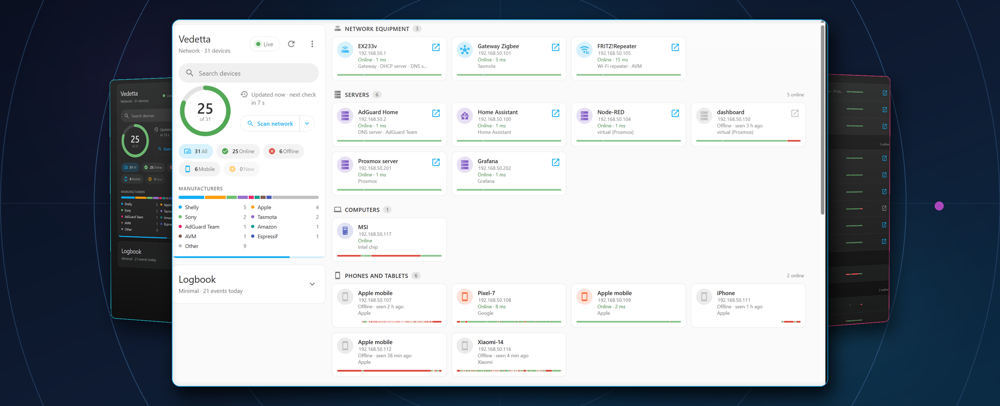

<div align="center">



<br>

[](#install)
[](vedetta/CHANGELOG.md)
[](#privacy--safety)
[](#)
[](LICENSE)

**[Install](#install) · [Screenshots](#screenshots) · [Features](#features) · [How it thinks](#how-it-recognizes-a-device) · [Home Assistant](#home-assistant-integration) · [Planned](#planned) · [Extend](#teach-it-a-new-device)**

</div>

---

## Why Vedetta

**The lookout of your LAN.** Your router says *“Unknown device”*; Vedetta says *“Sony console”* and shows how it knew. Two minutes to install, no cloud: [step by step](#install).

## Screenshots

<p align="center"></p>

<p align="center"><sub>Tiles or list · light or dark · one tap to the evidence behind every name</sub></p>

## Meet Vedetta

Your router lists *“android-7f3a…”* and *“Unknown device”*. Fing shows a brand and no reason. Home Assistant knows the
devices **you** set up, not the rest of your network.

**Vedetta is the lookout of your LAN.** It finds every device, works out *what it is* from many weak clues, and — this is
the part nobody does — **tells you why**. A name from a title page, a brand from a DHCP fingerprint, a PlayStation spotted
by the class it announces: every conclusion carries its evidence, and anything you set by hand is never overwritten.

It lives inside Home Assistant as an app (sidebar panel via ingress), reads Home Assistant’s own registry to learn the
names and rooms you already chose, and publishes back **only what you decide to share**.

> [!IMPORTANT]
> **Local-only.** No cloud, no accounts, no telemetry. See [Privacy & safety](#privacy--safety).

<h2 id="features"></h2>

| | |
|---|---|
| 🔭 **Three levels of search** | A light **ARP sweep** that only lists addresses; an **associative** scan of the devices you pick; a **deep** rescan (also nightly) with all ports and service detection, on everything or only on the devices not analysed in depth yet. Each method shows its risk with a colored dot — 🟢 non-intrusive, 🟠 intrusive, 🔴 risky — and you choose which ones run. |
| 🧠 **Real recognition** | Name, brand, model and category from ~15 independent sources, fused by family so one fact is never counted twice. Ambiguous? It stays in *Other* instead of guessing. |
| 🔎 **It explains itself** | A **debug view** shows every clue, its weight and where each name and brand came from. |
| 🏠 **Home Assistant aware** | Reads the device registry (read-only) for names, makers, models, areas and integrations; follows a rename made in HA. |
| 📤 **Share on demand** *(optional, needs [MQTT](#mqtt-optional))* | One button per device: **Share with HA** / **Remove from HA**. Shared devices appear as sub-devices of a single *Vedetta* device — never merged into your real ones. |
| 📱 **Remembers sleeping phones** | A passive Bonjour/DHCP listener remembers names when devices announce them, so a phone that sleeps keeps its name. |
| 📊 **Presence & latency** | Online/offline history (24 h / 7 days), response time, signal quality, uptime, open ports colored by category. |
| 🧭 **Network roles** | Detects gateway, DHCP and DNS servers, repeaters, access points, double NAT / CGNAT and your public IP. |
| 🛡️ **Careful by design** | Wake-on-LAN only where it makes sense, pause and resume, an ignore list, nothing written to your devices. |
| 🎨 **Home Assistant native look** | Same palette, light/dark, tiles or list, English and Italian, works in the mobile app. |

<h2 id="how-it-recognizes-a-device"></h2>

<p align="center"></p>

- 🗳️ **One fact, one vote.** Cast shows up as an mDNS service, a local API, two ports and a DIAL record — that is *one*
  clue, counted once.
- 🧩 **Platform ≠ function.** A Shelly or Tasmota tells you *“smart device”*, not *“gate opener”*. The word in the name wins.
- 🧾 **Signatures for the ambiguous.** A Google Home and a Chromecast both say “Cast”; the declared model settles it.
- 🧹 **Placeholders are not names.** `Android_7F3A…`, `wMAN MOD 1.47.45`, `shelly1-8CAA…` are recognized as noise and
  replaced by something better — or by *brand + type* (“Sony console”) when nothing else exists.
- 🤷 **Honest about doubt.** Two equally weak candidates → *Other devices*. You can always pick brand and type by hand.
- 🔍 **No black box.** The weights are public: see [the weights, in the open](#how-it-recognizes-a-device) just below.

<details>
<summary><b>The weights, in the open</b> — every number that decides a category and a name</summary>

<br>

**Category.** Each clue adds points to a category; clues that tell the *same fact* count once (the best of the family).

| Clue | Points |
|---|---:|
| Network role (gateway, repeater, access point) | **10** |
| Product signature from the catalog | **8 – 14** |
| Declared service or protocol (mDNS service, UPnP type, ONVIF, local API, Home Assistant integration) | **8** |
| RTSP server header | 6 |
| Service **confirmed** by nmap on a typical port | 4 |
| Brand that makes only one kind of device | 3 |
| Word in the name / page title / banner | 2 *(specific kind words 2–4)* |
| Port number only (service not confirmed) | 1 |

Guard rails: all ports of a category together **max 6**; generic platform clues (Shelly, Tasmota, ESPHome, a chip maker)
**max 3** in total, so a word like *“Thermostat”* always beats *“it runs Tasmota”*; **at least 2 points** or the device stays in
*Other*; two categories within 1 point below 5 points stay in *Other* instead of being picked at random. A category chosen
by hand always wins.

**Name.** The most reliable source wins; a name you set is never overwritten.

| Source | Weight |
|---|---:|
| **Your own name** | never replaced |
| Name you chose in Home Assistant | 95 |
| The device’s own local API | 90 |
| mDNS / Bonjour | 70 |
| Home Assistant integration / device name | 68 |
| UPnP friendly name | 65 |
| DHCP hostname | 55 |
| NetBIOS | 45 |
| Reverse DNS | 40 |
| TLS certificate host name | 38 |
| ONVIF | 35 |
| Web page title *(never a software name with a version)* | 30 |
| Placeholders (`Android_7F3A…`, `shelly1-8CAA…`) | 20 |

Nothing left? It builds one: **brand + model → brand + type → brand + category → network role** (“Server DNS”) → the IP address.
A generated name is never counted as evidence for the category — the app does not get to agree with itself.

</details>

<h2 id="home-assistant-integration"></h2>

| Direction | What happens |
|---|---|
| **HA → Vedetta** *(read-only)* | Device registry, areas and integrations give names, manufacturers, models and categories. Matched by MAC, or by the device’s configuration address when it is unique. Turn it off in *Search methods → Home Assistant data*. |
| **Vedetta → HA** *(your choice, needs MQTT)* | MQTT discovery publishes one **Vedetta** device (online / offline / mobile counters, average latency, *Scan now*). Per device, **Share with HA** adds a sub-device with tracker, connectivity and latency. Renames follow; removing cleans HA up. |

### MQTT (optional)

> [!NOTE]
> Sharing with Home Assistant uses **MQTT discovery**. MQTT is **not part of a default Home Assistant installation**:
> you need a broker and the MQTT integration.

- Easiest path: install the **[Mosquitto broker app](https://github.com/home-assistant/addons/blob/master/mosquitto/DOCS.md)**
  and add the **[MQTT integration](https://www.home-assistant.io/integrations/mqtt/)**. Vedetta then finds the broker on its own.
- Already have a broker? Enter its address in the app options (`mqtt_host`, `mqtt_port`, `mqtt_username`, `mqtt_password`).
- How the discovery messages work: [MQTT discovery](https://www.home-assistant.io/integrations/mqtt/#mqtt-discovery).

> [!TIP]
> Without MQTT everything else works — search, recognition, Home Assistant lookups, history. Only the **Share with HA** button
> (and the *Vedetta* device with its counters) needs it, and it stays hidden until a broker is connected.

<h2 id="planned"></h2>

> [!NOTE]
> ✅ A checked box means it is built, tested and released; the date is when it was done.

### 🧠 Trust and explanation
- [ ] Evidence card with a certainty bar and the rejected hypotheses
- [ ] Recognition of randomized (private) MAC addresses, merging duplicates of the same phone

### 🛡️ New devices and safety *(passive, no credential tests, nothing leaves your network)*
- [ ] Radar of new devices: "3 new since your last visit" with *it's mine / ignore*
- [ ] Clear-text services (telnet, FTP, SMB1) with severity per port
- [ ] Passive anomalies: second DHCP server, IP with two MACs, MAC that changes IP
- [ ] Device silent for days; IP changes and conflicts
- [ ] Every alert says why, what to do, and has *this is normal for me*
- [ ] Network health indicator with a public, explained formula
- [ ] TLS certificates close to expiry (self-signed shown as information only)
- [ ] UPnP / IGD: which devices have ports open to the Internet

### 🕰️ History
- [ ] Event timeline (arrivals, departures, IP and port changes)
- [ ] Before/after comparison between two scans, and "overnight" summary
- [ ] Time machine: snapshots and differences
- [ ] 90-bar status strips with latency sparklines
- [ ] Presence heatmap (7×24), local and opt-in only

### 📡 New local data sources
- [ ] Extended Home Assistant registry data (Zigbee, Matter, BLE: model, firmware, repeater, signal)
- [ ] Extended mDNS: IPP printers (model, toner), device info, HomeKit category, Matter/Thread
- [ ] Light labels: SSH/FTP/SMTP banners, favicon hash, ONVIF firmware and serial
- [ ] Passive listeners: LLDP, NetBIOS, WS-Discovery, IPv6 (NDP/DHCPv6)

### 🏠 Home Assistant
- [ ] `vedetta_new_device` event with brand, model and reason
- [ ] Native notification on a service you choose
- [ ] Ready-made blueprints (new device, critical device offline)
- [ ] More aggregate sensors (online, new today, unknown)
- [ ] Weekly digest notification
- [ ] "This device is also in HA as …" on the card
- [ ] Repairs and a custom integration *(later)*

### 🖼️ Views
- [ ] Per-room view from Home Assistant areas
- [ ] Topology map with certain links only *(later)*
- [ ] Screenshot mode (masks MAC and IP) and a first-run screen
- [ ] Compact Lovelace card *(later)*

### 💡 Original ideas
- [ ] Inventory export (CSV, JSON, Markdown) with an anonymize option
- [ ] Device identity card: first/last seen, notes, room, warranty
- [ ] "Ask Vedetta" with fixed Assist sentences, no language model
- [ ] "If this repeater drops, who disappears?"
- [ ] Offline, shareable signature packs *(later)*

<h2 id="privacy--safety"></h2>

- 🏡 Everything runs **inside your network**. Data lives in the app’s own `/data`, included in Home Assistant backups.
- 🌐 The only outbound requests are a periodic update of the MAC-vendor table and the optional public-IP check.
- 🔒 Home Assistant access is **read-only by construction**: only registry reads, no services, no writes.
- 🚪 The ingress panel only accepts the Supervisor. Passwords are never exported.
- 📦 *Export for analysis* (menu) builds a local zip for **you** to read or hand over; it is never sent anywhere.

<h2 id="install"></h2>

> [!NOTE]
> **Before you start.** Vedetta is a Home Assistant *app* (older versions call it an *add-on*). Open Home Assistant and go to
> **Settings**: if you see **Apps** (or **Add-ons**, or **Applicazioni** in Italian), you are ready. If you run Home Assistant *Container* or *Core*, there is no
> app store and Vedetta cannot run. It needs **Home Assistant OS** or **Supervised**.

Pick **one** of the two ways below. Both end the same way: Vedetta appears in your sidebar.

### Option A · Add the repository (the easy way)

> [!IMPORTANT]
> This works once the repository is public. Until then, use **Option B**.

1. **Add the repository.** Click the button:

   [](https://my.home-assistant.io/redirect/supervisor_add_addon_repository/?repository_url=https%3A%2F%2Fgithub.com%2FSived80%2Fvedetta)

   It opens a small My Home Assistant page (the first time it asks for your Home Assistant's address, usually `http://homeassistant.local:8123`). Press **Open link**. Home Assistant then asks **Add the app repository?** with the address already filled in: press **Add**.

   *Nothing asks and you land on the App store? Then the repository is already added: go on to step 2.*

   *Prefer to do it by hand, or the button does not work?* In Home Assistant open **Settings → Apps**, press **Install app** (bottom right) to open the App store, press **⋮** (top right) and choose **Repositories**. Press **Add** (bottom right), paste the address below and press **Add** again. The window closes by itself and **Vedetta** appears in the list:

   ```text
   https://github.com/Sived80/vedetta
   ```

   *In an Italian Home Assistant the same path is* **Impostazioni → Applicazioni → Installa app → ⋮ → Archivi digitali → Aggiungi**. *The App store page is titled* Raccolta delle app.

2. Back in the App store, type **Vedetta** in the search box. It shows up under its own heading. Open it: the page shows the version and an **Install** button. Press **Install**.
3. When it finishes, switch on **Show in sidebar**, then press **Start**.
4. Click **Vedetta** in the left sidebar (or open `http://homeassistant.local:8123/app/468cebee_vedetta`). Done: go to [First launch](#first-launch).

### Option B · Local app (works today)

You copy the app folder into Home Assistant's `addons` folder, using the **Samba share** app to reach it from your computer.

1. **Install Samba share.** *Settings → Apps → App store →* search **Samba share** *→ Install.* Open its **Configuration** tab, type a **username** and **password** of your choice, save, then press **Start**.
2. **Get the files.** You need the folder named `vedetta` (the one that contains `config.yaml`). Once the repository is public: on its GitHub page press **Code → Download ZIP** and unzip it.
3. **Open the Home Assistant folders from your computer.**
   - *Windows:* press <kbd>Win</kbd> + <kbd>E</kbd>, click the address bar, paste the line below and press <kbd>Enter</kbd>.
   - *Mac:* in Finder choose **Go → Connect to Server** and paste `smb://homeassistant.local/addons`.

   ```text
   \\homeassistant.local\addons
   ```

   Sign in with the Samba username and password from step 1. If `homeassistant.local` is not found, use your Home Assistant's IP address instead (for example `\\192.168.1.50\addons`).
4. **Copy the whole `vedetta` folder** into that `addons` folder. You should end up with `addons/vedetta/config.yaml`.
5. **Tell Home Assistant to look again.** *Settings → Apps → App store → ⋮ → Check for updates.* A **Local apps** section appears at the bottom with **Vedetta**.
6. Open it, press **Install**, switch on **Show in sidebar**, press **Start**.
7. Click **Vedetta** in the left sidebar, or jump straight in with a direct link (replace `homeassistant.local` with your Home Assistant's address if it is different):

   | Go to | Link |
   |---|---|
   | The Vedetta page | [`http://homeassistant.local:8123/app/local_vedetta`](http://homeassistant.local:8123/app/local_vedetta) |
   | The app's settings page (Start, Stop, Log) | [`http://homeassistant.local:8123/config/app/local_vedetta/info`](http://homeassistant.local:8123/config/app/local_vedetta/info) |
   | The Vedetta page, through My Home Assistant (asks for your address once) | [open Vedetta](https://my.home-assistant.io/redirect/supervisor_ingress/?addon=local_vedetta) |
   | The app's settings page, through My Home Assistant | [open the app page](https://my.home-assistant.io/redirect/supervisor_app/?app=local_vedetta) |

   > [!TIP]
   > Bookmark the first link. These links are for **Option B**. With Option A the app is named `468cebee_vedetta` (the code comes from the repository address, so it is the same for everyone): use `http://homeassistant.local:8123/app/468cebee_vedetta`.

> [!TIP]
> For developers: `tools/deploy_addon.sh` does steps 4-6 over SSH.
> `VEDETTA_HA_HOST=<your-ha-address> VEDETTA_HA_KEY=<ssh-key> tools/deploy_addon.sh`

### First launch

1. Open **Vedetta** from the sidebar. The first page may be empty: that is normal.
2. Press **Scan network**. Within a few seconds the devices on your network appear; add the ones you want on your board.
3. **Leave it running.** Vedetta is not learning: it collects clues, and some only arrive with time. Phones that were asleep announce their names when they wake up, the history bars (24 h and 7 days) fill in, and a deeper search runs every night. Expect most names to settle within a day. Devices that announce nothing (an iPhone with a private Wi-Fi address, for example) stay generic: set their name once by hand and it stays.
4. Curious why it chose a name? The debug view lists every clue behind each name and brand.

Want to share devices back into Home Assistant? That needs an MQTT broker: see [MQTT (optional)](#mqtt-optional). Everything else works without it.

### Something not working?

| What you see | What to try |
|---|---|
| Vedetta is not in the sidebar | Open the app page → **Info** tab → switch on **Show in sidebar**. |
| Option B: no **Local apps** section | Check the path is exactly `addons/vedetta/config.yaml`, then **⋮ → Check for updates** again. |
| `\\homeassistant.local` does not open | Use the IP address of Home Assistant, and check that **Samba share** is started. |
| The page opens but no devices appear | Open the app's **Log** tab. If you have several network cards, set the `interface` option (for example `enp0s18`). |
| An iPhone is called *Apple mobile* | Phones with a private Wi-Fi address announce nothing. Set the name once by hand and it stays. |
| After an update something looks old | Press <kbd>Ctrl</kbd> + <kbd>F5</kbd> in the browser. |

**Updating:** when a new version is out, *Settings → Apps → Vedetta → Update*.

<details>
<summary><b>Permissions, explained</b></summary>

| Permission | Why |
|---|---|
| Host network + `NET_ADMIN` / `NET_RAW` | `arp-scan`, `nmap`, ping, mDNS/SSDP, passive DHCP (UDP 67). Local requests only. |
| `homeassistant_api` | **Read-only** registry lookups (devices, entities, areas, integrations). |
| MQTT service *(optional)* | Publishes only what you choose to share, if a broker is available. |
| Ingress | UI reachable only through Home Assistant. |

</details>

<h2 id="teach-it-a-new-device"></h2>

Recognition is data, not code. A product signature in [`vedetta/app/data/signatures.json`](vedetta/app/data/signatures.json)
is a few conditions on what a device declares:

```json
{
  "id": "google-home-speaker",
  "group": "audio",
  "kind": "speaker",
  "weight": 14,
  "fixture": "simulated",
  "all": [{ "field": "mdns_model", "re": "google home|home mini|nest mini|nest audio" }]
}
```

`fixture` says whether the signature comes from a **real** device or from the manufacturer’s published data. Export your
device with *Export for analysis*, find the clue that sets it apart, add a row, run the tests.

<h2 id="development"></h2>

```text
vedetta/            the app (config.yaml, Dockerfile, FastAPI backend, vanilla-JS frontend)
tests/              check_*.py — real-device fixtures and unit checks
tools/              run_tests.py · deploy_addon.sh
```

```bash
python tools/run_tests.py     # everything, from the vedetta/ folder
```

**Stack:** Python 3.14 · FastAPI · asyncio · python-zeroconf · nmap/arp-scan · SQLite · paho-mqtt · plain JavaScript (no
build step).

## 📜 License and credits

Vedetta is open source under the **[MIT License](LICENSE)**. Everything it builds on is listed, with its license, in
[THIRD_PARTY_NOTICES.md](THIRD_PARTY_NOTICES.md).

- 🧰 **Nmap** and **arp-scan** are installed from the Alpine package repository when the app is built on *your* Home
  Assistant. They are **not included** in this repository; Vedetta runs them as separate programs.
- 🏭 MAC vendor names come from the public **IEEE registries**; icons from **Material Design Icons** (Apache-2.0).
- ™️ Brand and product names are used only to describe the devices Vedetta recognizes. This project is not affiliated
  with or endorsed by any of them.

---

<div align="center"><sub>Built to be <b>explainable</b>. If it names something wrong, it will show its work — and you will always have the last word.</sub></div>
